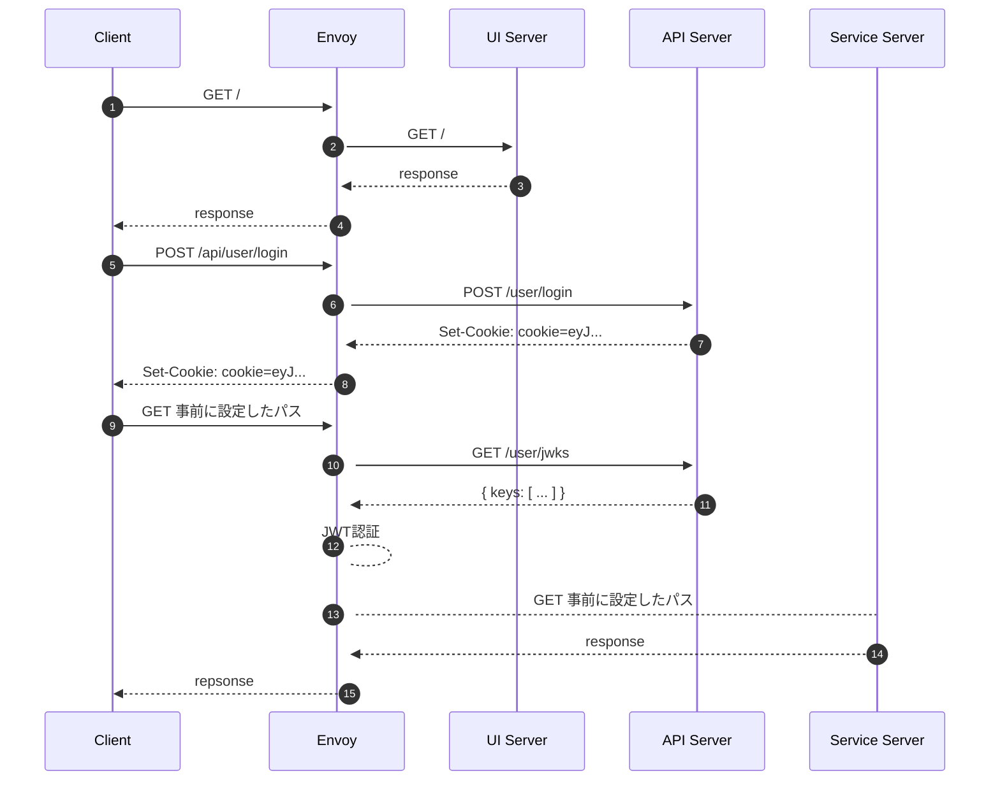

# service_auth

単純な認証サービス。

## 認証フロー



## 実行

コンテナを起動する。

```sh
$ cd development
$ docker-compose up -d
```

APIサーバを起動する。
```sh
$ cd api
$ cargo run -- --bind 0.0.0.0:8080
```

UIサーバを起動する。
```sh
$ cd ui
$ yarn install
$ yarn dev
```

http://localhost:10000/ を開く。
